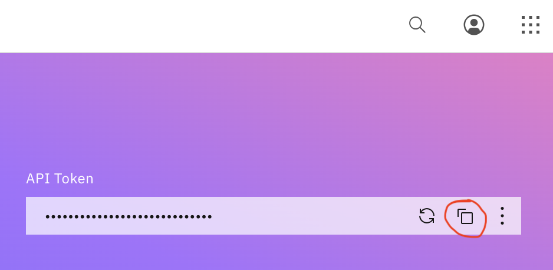
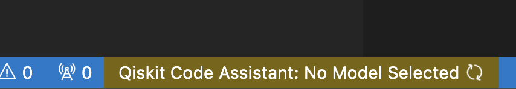
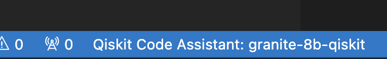
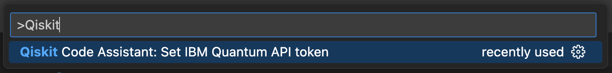
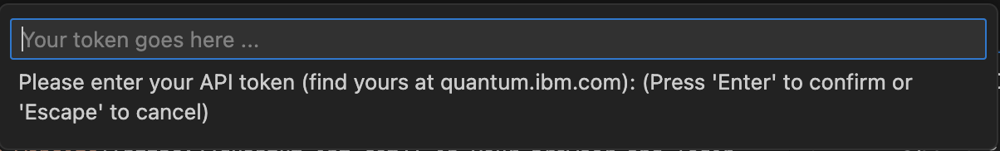
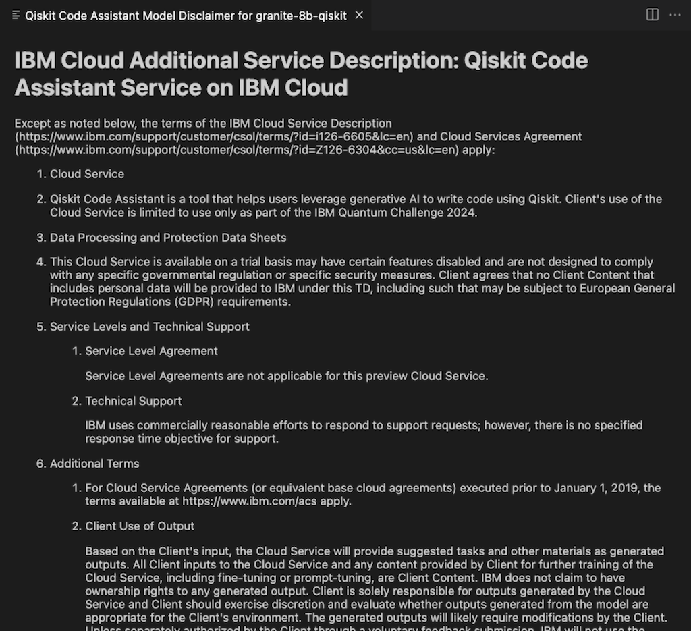
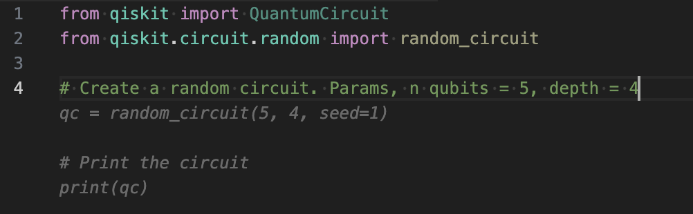
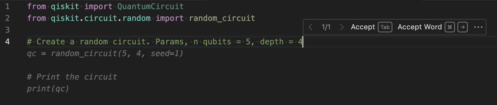

# Gettting Started with the Qiskit Code Assistant

## Requirements

- Visual Studio Code
- An IBM Quantum premium account

## Install

To install the extension

1. Launch Visual Studio Code
1. Click on the Extensions tab
1. Search for `qiskit-vscode`
1. Click **Install** for the "Qiskit Code Assistant"

## Uninstall

To remove the extension

1. Go into the Extensions tab in Visual Studio Code
1. Select the **Qiskit Code Assistant** extension under the **INSTALLED** section
1. Click **Uninstall**

## Using the Qiskit Code Assistant

### IBM Quantum API Token

To make calls to the service API the extension requires an IBM Quantum Cloud API token.

#### Getting your API token

1. Open the [IBM Quantum website](https://quantum.cloud.ibm.com/) in your browser
1. Login with your IBM Quantum account
1. Copy the API token displayed on the upper right side of the webpage (after logging in)

#### Submitting your API token to the extension

When the extension first starts the status bar will show a spinning icon meaning it is trying to connect to the service

If successful, the status will change to display the model name

If the spinning icon disappears and the status bar remains with the "No Model Selected" message then you may need to enter your API Token.

1. In Visual Studio Code press `Cmd/Ctrl+Shift+P` to open the VS Code command palette
1. Type `Qiskit`
1. Select the **Qiskit Code Assistant: Set IBM Quantum API token** command

    

1. Paste the IQP API token copied earlier from IBM Quantum page and hit Enter.

    

### Accepting the model disclaimer

By default, the extension will use the `granite-3.3-8b-qiskit` model. It will appear in the Model Picker in the bottom status bar.

The first time you use the `granite-3.3-8b-qiskit` model a model info view will open and explain a little about the model with links to documentation and the model's license. It will also list some major restrictions that you should be aware of when using the model. Clicking `Accept` will accept the model disclaimer and enable the model for code generation.

### Using the Code Generation

Once you've accepted the model disclaimer you can open a new file and start typing. If you type `Ctrl+.`, some faded text should appear with model-generated suggestions.

You may press `Tab` to accept the model-generated suggestion or press `ESC` to cancel/reject the model-generated suggestion.

Afterwards, you may type `Ctrl+.` again to generate additional suggestions. Also, when you see the faded text (i.e., model-generated suggestion) you can type `Alt/Option+]` and `Alt/Option+[` to cycle forward and backward, respectively, through the suggestions (if available). You can also hover the cursor over the faded
text to use the pop-up toolbar to cycle through the suggestions.

### Visual Studio Code Settings

If necessary, you can update some settings for the extension.

1. To change the instance of the Qiskit Code Assistant Service that the extension should use you can edit the `Qiskit Code Assistant: Url` in the User Settings

1. Keyboard shortcuts can be changed by searching for `qiskit-vscode` in the Keyboard Shortcuts settings

1. The Telemetry can be disabled by unchecking the `qiskitCodeAssistant.enableTelemetry` setting or turning `off` the `telemetry.telemetryLevel` setting:

   > **NOTE**: The telemetry does not collect your code nor the suggested code completions. What is collected is whether a code suggestion was accepted or dismissed.

1. Completion data can be streamed by checking the `qiskitCodeAssistant.enableStreaming` setting

## Troubleshooting

If you are not seeing the extension status bar in Visual Studio Code, check the extension is installed and enabled under the Extensions tab.

If the extension is installed and enabled, but not able to select a model, make sure your current API Token has been added and the `Qiskit Code Assistant: Url` setting is properly configured.

## Providing Feedback

General feedback can be provided to the Qiskit Code Assistant team by clicking on the `Provide feedback` icon in status bar (left of the Qiskit Code Assistant model info). 

Feedback for a specific prompt and generated code suggestion can be provided by clicking on the `thumbs up`/`thumbs down` icons that appear immediately above the suggested code block.

### Code Migration Feedback

After using the code migration feature (sparkle icon ✨), feedback can be provided in the same way as code suggestions - through the `thumbs up`/`thumbs down` icons that appear above the migrated code block.
