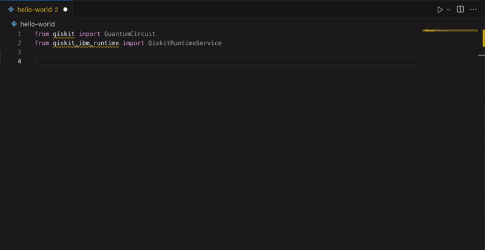
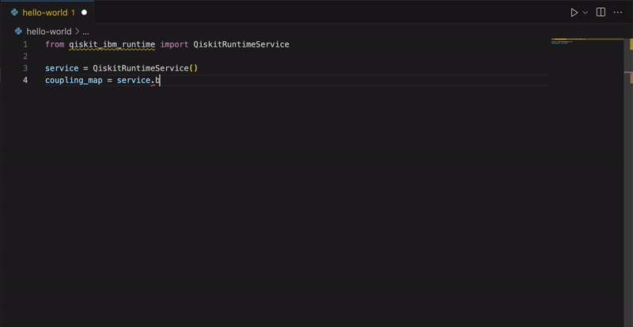

# Qiskit Code Assistant (Beta)

Write and optimize Qiskit code with a generative AI code assistant powered by IBM **watsonx**.

> This experimental feature is only available, as of today, to IBM Quantum premium users.
  If you are not part IBM Quantum premium plan, you can still install this extension; however you will not be able to use the assistant.
  The Qiskit Code Assistant is a beta release, subject to change.

**************

Increase quantum computing developer productivity and learn best practices for Qiskit and IBM Quantum Platform services with Qiskit Code Assistant!

**************

Make programming quantum computers even easier with Qiskit Code Assistant, a generative AI code assistant powered by IBM **watsonx**. Trained with approximately 370 million text tokens from Qiskit SDK v1.x, years of Qiskit code examples, and IBM Quantum features, Qiskit Code Assistant accelerates your quantum development workflow by offering LLM-generated suggestions based on [IBM Granite 8B Code](https://www.ibm.com/products/watsonx-ai/foundation-models) that incorporate the latest features and functionalities from IBM. And soon, Qiskit Code Assistant will be able to be used alongside Qiskit patterns building blocks for reusable code and workflow simplification.

Qiskit is the open-source quantum SDK preferred by 69% of respondents to the Unitary Fund's Open Source Software Survey, with nearly 600,000 registered users to date. Now you can get the performance and stability of the Qiskit SDK with the added efficiency of Qiskit Code Assistant to streamline your workflow and optimize your quantum computing programs.

## Features

* Accelerate Qiskit code generation by leveraging generative AI based on the `granite-8b-qiskit` model
* Use abstract and specific prompts to generate recommendations
* Manage code changes by reviewing, accepting, and rejecting suggestions
* Supports Python code files

## Learn the best ways to use Qiskit and IBM Quantum Platform services

Improve your Qiskit code by reviewing, browsing, and accepting model-generated code suggestions.

### Use abstract prompts to get started

Provide abstract prompts to Qiskit Code Assistant using `#comments`. Type `Ctrl+.` following a `#comment` to obtain syntactically correct and contextually relevant content (up to 60 tokens) suited to your desired task.

### Use specific prompts for streamlined code completion

Use `Ctrl+.` with code to obtain specific model-generated suggestions for code completion based on semantic analysis of source code. Review code recommendations before accepting.

## Get started

### Obtain your IBM Quantum Platform API token

Open the [IBM Quantum Platform](https://quantum.ibm.com/) in your browser and log in with your IBM Quantum account. After logging in, an IBM Quantum API token is displayed on the upper right side of the web page.

### Set the API token in VS Code

Press `Cmd/Ctrl+Shift+P` to open the VS Code command palette.

Type `Qiskit Code Assistant: Set IBM Quantum API token`.

Paste your IBM Quantum API token in the pop-up dialog and press `Enter`.

### Accept the model disclaimer/EULA

By default, the model you will use is `granite-8b-qiskit`. It will appear in the Model Picker in the bottom of the status bar.

The first time you use the `granite-8b-qiskit` model, a model disclaimer/EULA will appear with information about the model and links to documentation and the model's license. It will also list some restrictions that you should be aware of when using the model, including a restriction against using proprietary code. Clicking `Accept` will enable the new model during code generation.

### Generate code suggestions

Once you've accepted the model disclaimer/EULA, you can open a new file and start typing. If you type `Ctrl+.`, some faded text should appear with model-generated suggestions.

### Review and accept/reject code suggestions

Type `Tab` to accept the model-generated suggestion, or type `Esc` to cancel/reject the model-generated suggestion.

## Keyboard shortcuts

Customize keyboard shortcuts in VS Code using the `Keyboard Shortcuts` editor. To open the editor, visit the menu under **Code** > **Settings** > **Keyboard Shortcuts** or use the **Preferences: Open Keyboard Shortcuts** command (`Cmd+K` + `Cmd+S`). Add or modify keybindings to map keyboard shortcuts to desired Qiskit Code Assistant commands using the suggestions provided below.

| **Command**                | **Keybinding**                    | **Description**           |
|:---------------------------|:----------------------------------------|:--------------------------|
| `qiskit-vscode.accept-suggestion` | `Tab` | Accept the model-generated suggestion |
| `qiskit-vscode.handle-get-completion` | `Ctrl+.`                | Generate suggestions |

## Terms of use

* [End User License Agreement (EULA)](https://github.com/Qiskit/qiskit-code-assistant-vscode/blob/main/docs/EULA.md) acceptance required before starting to use the model
* Terms of use: [https://quantum.ibm.com/terms](https://quantum.ibm.com/terms)
* Privacy policy: [https://quantum.ibm.com/terms/privacy](https://quantum.ibm.com/terms/privacy)
* Cloud Services Agreement [https://www.ibm.com/support/customer/csol/terms/?id=Z126-6304&cc=us&lc=en](https://www.ibm.com/support/customer/csol/terms/?id=Z126-6304&cc=us&lc=en)
* IBM Cloud Service Description [https://www.ibm.com/support/customer/csol/terms/?id=i126-6605&lc=en](https://www.ibm.com/support/customer/csol/terms/?id=i126-6605&lc=en)
