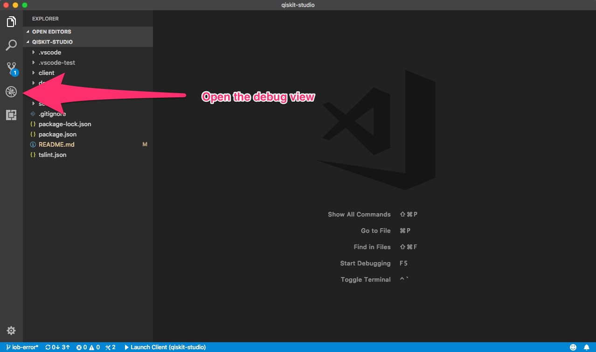
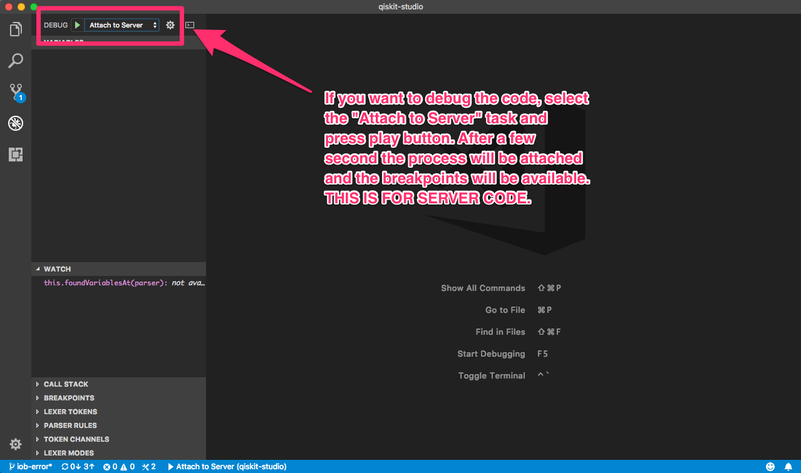

# IBM Q Studio
> IBM Q Studio is a tool that makes simple working with QASM files and QISKit SDK.

IBM Q Studio is a Visual Studio Code extension, that allow the researchers and developers create and execute Quantum circuits. After the execution the results can be evaluated.

You can find additional information about planning and future of Q Studio [here](https://ibm.ent.box.com/notes/282598814468).

## Q Studio features

### Errors highlighting

Below there is a list of the syntactic and semantic errors detected by the extension:

:white_check_mark: Not previously defined symbols.

:white_check_mark: Duplicated symbol definition.

:white_check_mark: Out of bound position in a register.

:white_check_mark: Wrong type at measure operation.

:white_check_mark: Wrong type at gate invocation.

:white_check_mark: Wrong types in conditional sentences.

:soon: Wrong number of arguments in a gate invocation.

### Dependency Management

IBM Q Studio includes features to manage the related dependencies. IBM Q Studio will not work  without `python` (>=3.5) and `pip` (>=9.0.0) installed in your system (or virtualenv). Apart of python and pip, this extension requires the `qiskit` SDK (and related dependencies) to run executions and to use other core-features.

To assure the proper work of this extension, it checks your environment to verify it includes the different dependencies, allowing also to update or install them if it is needed.


### Work with different _virtualenvs_
In the Python ecosystem is common to use different _virtualenvs_ to manage the execution environment. In our case, we allow users to change their python virtualenvs using the VSCode utilities as documented in  https://code.visualstudio.com/docs/python/environments 

If you change your Python _virtualenv_ after beginning your use of VSCode, please check again the IBM Q Studio-related dependencies using the command `qstudio.checkDependencies` to assure the proper running of this extension.


### Custom VSCode commands
Currently, this extension includes the following commands:

  * `qstudio.reload`: reload all the extension.
  * `qstudio.checkDependencies`: checks the dependencies. Pretty useful if changing between different _virtualenvs_.

## Installation

TBD (documentation for the Microsoft Code market should be created)

### How to run locally

NPM is required to run the project in a local environment.

```sh
npm install
npm run compile
```

Open the project with Visual Studio Code and follow the instructions below.






## Usage example

TBD

## Development setup

In Visual Studio Code, a language support extension is a little bit different from a basic extension because the first requires a server. One recommendation (from Microsoft documentation) is to keep client and server code in different folders.

```
.
├── .gitignore
├── .vscode                             // VS Code integration
│   ├── launch.json
│   ├── settings.json
│   └── tasks.json
├── .vscodeignore                       // files ignored when publishing extension
├── client                      
│   ├── out
|   |   └── ...                         // compiled code from the client
│   ├── src                             // source code from the client
│   |   ├── extension.ts                // client extension entry point
|   |   └── test                        // test folder
│   |       ├── extension.test.ts       
│   |       └── index.ts                
│   ├── syntaxes
|   |   └── ...                         // files related with syntax completion and hightlight
|   ├── package.json                    // client extension's manifest
|   ├── *.configuration.json            // files related with closing brackets helper and comments detection
|   └── tsconfig.json                   // Typescript client extension descriptor file
├── server                      
│   ├── out
|   |   └── ...                         // compiled code from the server
│   ├── src                             // source code from the server
│   |   ├── server.ts                   // server extension entry point
|   ├── package.json                    // server extension's manifest
|   └── tsconfig.json                   // TypeScript server extension descriptor file
├── package.json                        // extension's common manifest elements
└── tslint.json                         // TypeScript linter configuration file
```

### Parser design 

The server side of the extension is divided into various components to being able to evolve it more easily.


### Configuring Python >3.5

The extension have some previous requirements, one of them is Python 3.5 or greater.

#### MacOS X

If there is no XCode command line tools installed.

```
xcode-select --install
```

It is recommended to continue using [Homebrew](https://brew.sh/index_es) as a package manager.

```
brew install python3
cd <your-directory>
python3 -m venv <your-virtual-env>
source <your-virtual-env>/bin/activate
```

Some additional information can be found in this [link](https://www.digitalocean.com/community/tutorials/how-to-install-python-3-and-set-up-a-local-programming-environment-on-macos).

## Interesting links

### Visual Studio Code extensions

* [Your first VS Code extension tutorial](https://code.visualstudio.com/docs/extensions/example-hello-world)
* [How to create a language server?](https://code.visualstudio.com/docs/extensions/example-language-server)
* [VS Code extension examples](https://code.visualstudio.com/docs/extensions/samples)

### Jison related links

* [Online Jison generator](http://zaa.ch/jison/try/usf/#prod_1): This web is quite interesting because it is able to extract firsts and follows of the grammar. One thing that is not possible in the auto-generated parser from the Jison console command.

### ANTLR4 related links

* [Autocompletion library from Mike Lichske](https://github.com/mike-lischke/antlr4-c3)
* [Universal code completion with ANTLR3](http://www.soft-gems.net/index.php/tools/47-universal-code-completion-using-antlr3)

## Meta

TBD

## Authors (alphabetical)

IBM Q Studio was originally authored by Juan Cruz-Benito, Yeray Darias, Ismael Faro, Juan Gómez and Paco Martín.

And continues to grow with the help and work of [many people](./CONTRIBUTORS.md) who contribute to the project at different levels.


## License 
This project uses the [Apache License Version 2.0 software license](https://www.apache.org/licenses/LICENSE-2.0).