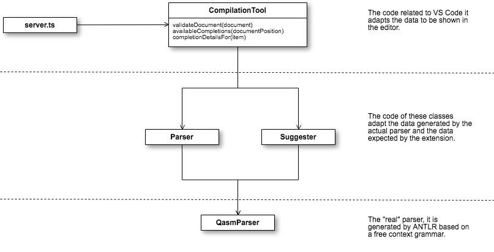

# Qiskit Studio extension structure

In Visual Studio Code, a language support extension is a little bit different from a basic extension because the first requires a server. One recommendation (from Microsoft) is to keep client and server code in different folders.

```
.
├── .gitignore
├── .vscode                             // VS Code integration
│   ├── launch.json
│   ├── settings.json
│   └── tasks.json
├── .vscodeignore                       // files ignored when publishing extension
├── client                      
│   ├── out
|   |   └── ...                         // compiled code from the client
│   ├── src                             // source code from the client
│   |   ├── extension.ts                // client extension entry point
|   |   └── test                        // test folder
│   |       ├── extension.test.ts       
│   |       └── index.ts                
│   ├── syntaxes
|   |   └── ...                         // files related with syntax completion and hightlight
|   ├── package.json                    // client extension's manifest
|   ├── *.configuration.json            // files related with closing brackets helper and comments detection
|   └── tsconfig.json                   // Typescript client extension descriptor file
├── server                      
│   ├── out
|   |   └── ...                         // compiled code from the server
│   ├── src                             // source code from the server
│   |   ├── server.ts                   // server extension entry point
|   ├── package.json                    // server extension's manifest
|   └── tsconfig.json                   // TypeScript server extension descriptor file
├── package.json                        // extension's common manifest elements
└── tslint.json                         // TypeScript linter configuration file
```

## Parser design 

The server side of the extension is divided into various components to being able to evolve it more easily.



* Server is the main code that launches the server side features of the extension.
* CompilationTool is the "interface" that gives document validation and autocompletion tips to the extension, through the Parser.
* Parser is an adapter that is able to translate the results from the real parser engine, into the objects that the extension and CompilationTool understand.
* QasmParserEngine is the real implementation of the parser for qasm files.